<div align="center">

<h3><code>bellilihamza@github ~ $ ./contributions.sh</code></h3>


<br><br>

<h3><code>bellilihamza@github ~ $ whoami</code></h3>
<table>
  <tr>
    <td valign="top"></td>
    <td valign="top"></td>
  </tr>
</table>

<br>

<a href="https://github.com/bellilihamza">GitHub</a>

</div>

## Local generation

The contribution graph is refreshed by [.github/workflows/update-profile-art.yml](./.github/workflows/update-profile-art.yml).

```bash
python -m venv .venv
# Windows: .venv\Scripts\activate
# macOS/Linux: source .venv/bin/activate
pip install -r scripts/requirements.txt
python scripts/fetch_contributions.py
python scripts/render_heatmap_svg.py
```

To regenerate the portrait, use the included `my_image.jpg` (or replace it with your own photo), then run:

```bash
python scripts/prep_photo.py my_image.jpg
python scripts/make_ascii_svg.py
```

The daily workflow uses only `scripts/requirements.txt`. For portrait work, install the optional image packages with `pip install -r scripts/requirements-portrait.txt`.
Use `--remove-background` when the local rembg model is already installed; without it, the pipeline avoids the large model download and still enhances the source photo.
